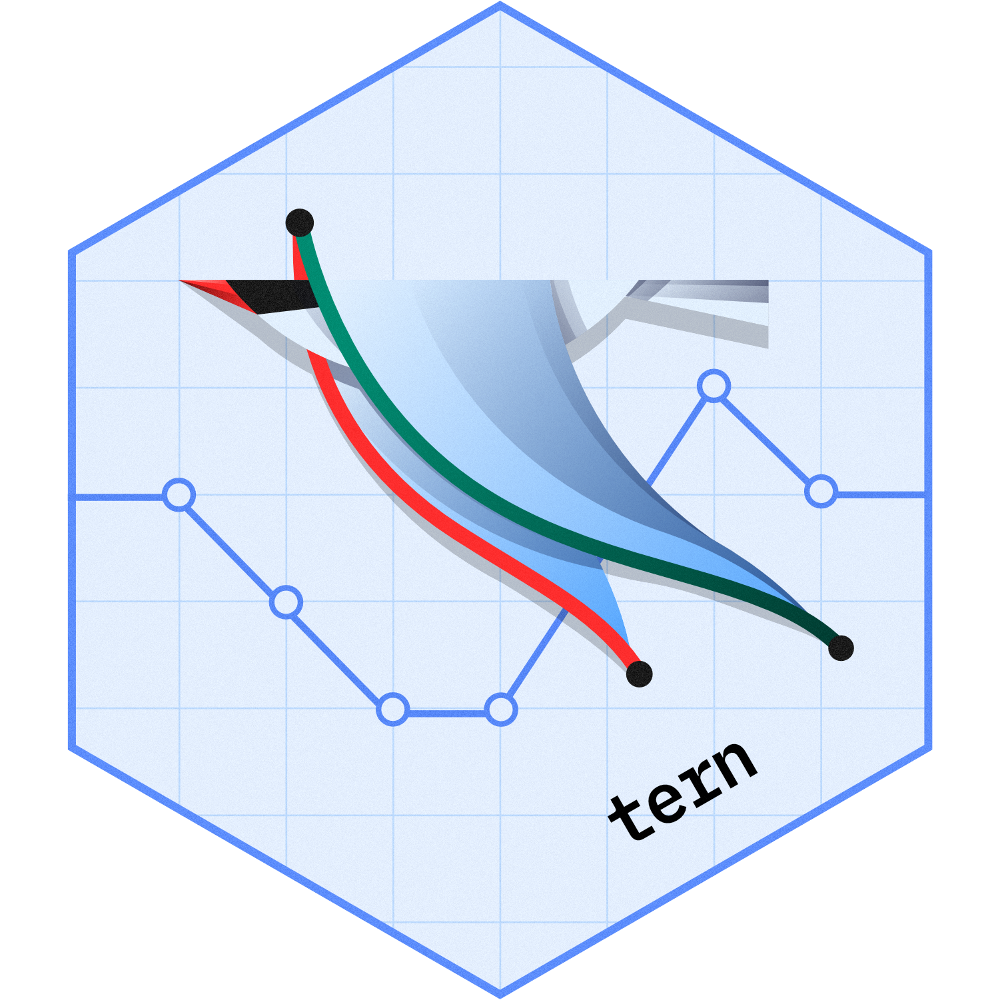

# tern <a href='https://github.com/pharmaverse/tern'></a>

<!-- start badges -->
[](https://pharmaverse.github.io/tern/main/unit-test-report/)
[](https://pharmaverse.github.io/tern/)
[](https://pharmaverse.github.io/tern/main/coverage-report/)


[](https://www.repostatus.org/#active)
[](https://github.com/pharmaverse/tern/tree/main)
[](https://github.com/pharmaverse/tern/issues?q=is%3Aissue+is%3Aopen+sort%3Aupdated-desc)
<!-- end badges -->

The `tern` R package contains analysis functions to create tables and graphs used for clinical trial reporting.

The package provides a large range of functionality, such as:

<!-- markdownlint-disable MD007 MD030 -->

Data visualizations:

-   Line plots ([`g_lineplot`](https://pharmaverse.github.io/tern/latest-tag/reference/g_lineplot.html))
-   Kaplan-Meier plots ([`g_km`](https://pharmaverse.github.io/tern/latest-tag/reference/g_km.html))
-   Forest plots ([`g_forest`](https://pharmaverse.github.io/tern/latest-tag/reference/g_forest.html))
-   STEP graphs ([`g_step`](https://pharmaverse.github.io/tern/latest-tag/reference/g_step.html))
-   Individual patient plots ([`g_ipp`](https://pharmaverse.github.io/tern/latest-tag/reference/g_ipp.html))
-   Waterfall plots ([`g_waterfall`](https://pharmaverse.github.io/tern/latest-tag/reference/g_waterfall.html))
-   Bland-Altman plots ([`g_bland_altman`](https://pharmaverse.github.io/tern/latest-tag/reference/g_bland_altman.html))

Statistical model fit summaries:

-   Logistic regression ([`summarize_logistic`](https://pharmaverse.github.io/tern/latest-tag/reference/summarize_logistic.html))
-   Cox regression ([`summarize_coxreg`](https://pharmaverse.github.io/tern/latest-tag/reference/cox_regression.html))

Analysis tables:

-   See a list of all available analyze functions [here](https://pharmaverse.github.io/tern/latest-tag/reference/analyze_functions.html)
-   See a list of all available summarize functions [here](https://pharmaverse.github.io/tern/latest-tag/reference/summarize_functions.html)
-   See a list of all available column-wise analysis functions [here](https://pharmaverse.github.io/tern/latest-tag/reference/analyze_colvars_functions.html)

<!-- markdownlint-enable MD007 MD030 -->

Many of these outputs are available to be added into [`teal`](https://insightsengineering.github.io/teal/) shiny applications for interactive exploration of data. These `teal` modules are available in the [`teal.modules.clinical`](https://insightsengineering.github.io/teal.modules.clinical/) package.

See the [TLG Catalog](https://insightsengineering.github.io/tlg-catalog/) for an extensive catalog of example clinical trial tables, listings, and graphs created using `tern` functionality.

## Installation

`tern` is available on CRAN and you can install the latest released version with:

```r
install.packages("tern")
```

or you can install the latest development version directly from GitHub by running the following:

```r
# install.packages("pak")
pak::pak("pharmaverse/tern")
```

## Usage

To understand how to use this package, please refer to the [Introduction to `tern`](https://pharmaverse.github.io/tern/latest-tag/articles/tern.html) article, which provides multiple examples of code implementation.

See package vignettes `browseVignettes(package = "tern")` for usage of this package.

## Related

- [`rtables`](https://pharmaverse.github.io/rtables/) - table engine used
- [`tlg-catalog`](https://insightsengineering.github.io/tlg-catalog/) - website showcasing many examples of clinical trial tables, listings, and graphs
- [`teal.modules.clinical`](https://insightsengineering.github.io/teal.modules.clinical/) - `teal` modules for interactive data analysis

## Acknowledgment

This package is the result of the joint efforts by many developers and stakeholders. We would like to thank everyone who has contributed so far!
